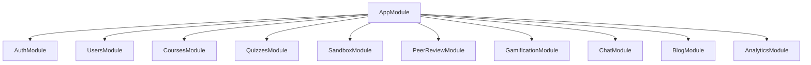
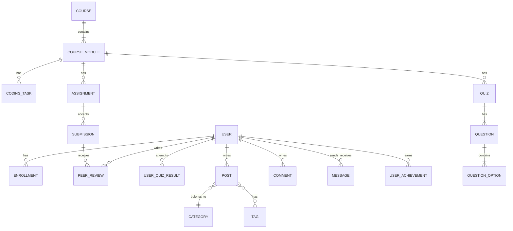
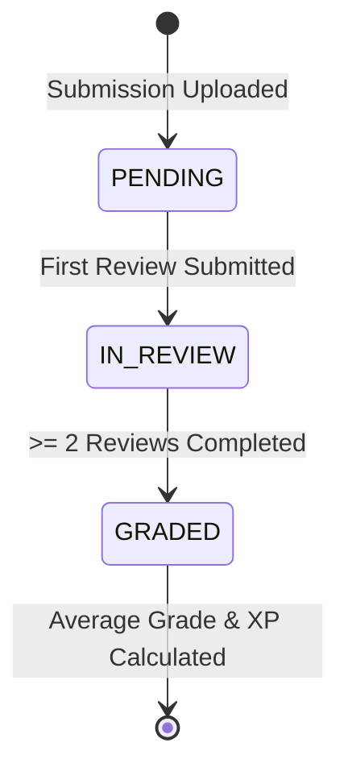

# Backend Implementation Plan: NestJS, SQLite, & TypeORM (Migration from Spring-CMS)

This plan outlines the design and implementation steps for migrating the Java Spring Boot LMS/CMS (**Spring-CMS / Project Nova**) to a modern, modular **NestJS** backend utilizing **SQLite** and **TypeORM**.

---

## 🛠️ 1. Architecture Overview & Setup

NestJS provides a modular structure that maps naturally to Spring Boot's packages. SQLite acts as a lightweight, single-file replacement for the H2 database.



### 📦 Dependencies to Install
```bash
# Core NestJS Database & ORM
npm install @nestjs/typeorm typeorm sqlite3
npm install -D @types/sqlite3

# Security, Auth & Hashing
npm install @nestjs/jwt @nestjs/passport passport passport-jwt bcrypt
npm install -D @types/bcrypt @types/passport-jwt @types/passport

# Validators & Utilities
npm install class-validator class-transformer
npm install @nestjs/event-emitter @nestjs/axios socket.io
npm install @nestjs/websockets @nestjs/platform-socket.io
```

### ⚙️ Database Configuration (`TypeOrmModule` Setup)
Register the database connection in `src/app.module.ts`:
```typescript
import { Module } from '@nestjs/common';
import { TypeOrmModule } from '@nestjs/typeorm';

@Module({
  imports: [
    TypeOrmModule.forRoot({
      type: 'sqlite',
      database: 'data/nova.sqlite',
      entities: [__dirname + '/**/*.entity{.ts,.js}'],
      synchronize: true, // Set to false in production, use migrations
      logging: ['query', 'error'],
    }),
    // ...other modules
  ],
})
export class AppModule {}
```

---

## 🗄️ 2. Database Schema & Entities

Here is the TypeORM entity mapping matching the legacy H2 Schema.



### Key TypeORM Entities Implementation Guide

#### 1. User Entity (`src/users/entities/user.entity.ts`)
```typescript
import { Entity, PrimaryGeneratedColumn, Column, CreateDateColumn, UpdateDateColumn } from 'typeorm';

export enum UserRole {
  STUDENT = 'STUDENT',
  TEACHER = 'TEACHER',
  ADMIN = 'ADMIN',
}

@Entity('users')
export class User {
  @PrimaryGeneratedColumn('uuid')
  id: string;

  @Column({ unique: true })
  email: string;

  @Column()
  passwordHash: string;

  @Column()
  fullName: string;

  @Column({ type: 'simple-enum', enum: UserRole, default: UserRole.STUDENT })
  role: UserRole;

  @Column({ default: 0 })
  xp: number;

  @Column({ default: 1 })
  level: number;

  @Column({ nullable: true })
  lastOpenedCourseId: string;

  @Column({ nullable: true })
  lastOpenedModuleId: string;

  @CreateDateColumn()
  createdAt: Date;

  @UpdateDateColumn()
  updatedAt: Date;
}
```

#### 2. Course & Module Entities (`src/courses/entities/course.entity.ts`)
```typescript
@Entity('courses')
export class Course {
  @PrimaryGeneratedColumn('uuid')
  id: string;

  @Column()
  title: string;

  @Column('text')
  description: string;

  @Column()
  instructorId: string;

  @OneToMany(() => CourseModule, (module) => module.course, { cascade: true })
  modules: CourseModule[];
}

@Entity('course_modules')
export class CourseModule {
  @PrimaryGeneratedColumn('uuid')
  id: string;

  @Column()
  title: string;

  @Column('text')
  content: string; // Supports Markdown

  @Column({ type: 'int' })
  orderNumber: number;

  @ManyToOne(() => Course, (course) => course.modules, { onDelete: 'CASCADE' })
  course: Course;
}
```

#### 3. Quiz & Question Entities (`src/quizzes/entities/quiz.entity.ts`)
```typescript
@Entity('quizzes')
export class Quiz {
  @PrimaryGeneratedColumn('uuid')
  id: string;

  @Column()
  title: string;

  @Column()
  moduleId: string;

  @OneToMany(() => Question, (q) => q.quiz, { cascade: true })
  questions: Question[];
}

@Entity('questions')
export class Question {
  @PrimaryGeneratedColumn('uuid')
  id: string;

  @Column('text')
  text: string;

  @ManyToOne(() => Quiz, (quiz) => quiz.questions, { onDelete: 'CASCADE' })
  quiz: Quiz;

  @OneToMany(() => QuestionOption, (opt) => opt.question, { cascade: true })
  options: QuestionOption[];
}

@Entity('question_options')
export class QuestionOption {
  @PrimaryGeneratedColumn('uuid')
  id: string;

  @Column()
  text: string;

  @Column({ default: false })
  isCorrect: boolean;

  @ManyToOne(() => Question, (q) => q.options, { onDelete: 'CASCADE' })
  question: Question;
}
```

---

## 🔒 3. Authentication & Roles Guard

Authentication uses **Passport-JWT**. We enforce roles via a custom guard:

### 🛡️ Custom Roles Guard (`src/auth/guards/roles.guard.ts`)
```typescript
import { Injectable, CanActivate, ExecutionContext } from '@nestjs/common';
import { Reflector } from '@nestjs/core';
import { UserRole } from '../../users/entities/user.entity';

@Injectable()
export class RolesGuard implements CanActivate {
  constructor(private reflector: Reflector) {}

  canActivate(context: ExecutionContext): boolean {
    const requiredRoles = this.reflector.getAllAndOverride<UserRole[]>('roles', [
      context.getHandler(),
      context.getClass(),
    ]);
    if (!requiredRoles) return true;

    const { user } = context.switchToHttp().getRequest();
    return requiredRoles.includes(user.role);
  }
}
```

---

## 💻 4. Coding Sandbox (Piston API & Importer)

The code submission pipeline hooks up to the **Piston API** to evaluate Student solutions safely.

### 🧪 Sandbox Service (`src/sandbox/sandbox.service.ts`)
```typescript
import { Injectable } from '@nestjs/common';
import { HttpService } from '@nestjs/axios';
import { firstValueFrom } from 'rxjs';

@Injectable()
export class SandboxService {
  constructor(private readonly httpService: HttpService) {}

  async executeCode(language: string, sourceCode: string, stdin = '') {
    const payload = {
      language,
      version: '*',
      files: [{ content: sourceCode }],
      stdin,
    };
    
    const response = await firstValueFrom(
      this.httpService.post('https://emkc.org/api/v2/piston/execute', payload)
    );
    return response.data.run; // Returns { stdout, stderr, code, signal }
  }
}
```

### 📥 Markdown Parser for Importer
For teachers uploading tasks from `.md` files, parse using regex:
```typescript
parseMarkdownTask(content: string) {
  const title = content.match(/#\s+(.+)/)?.[1];
  const language = content.match(/Language:\s*(\w+)/)?.[1];
  const xp = parseInt(content.match(/XP:\s*(\d+)/)?.[1] || '0', 10);
  const starterCode = content.match(/```\w+\n([\s\S]*?)```/)?.[1];
  
  // Extract custom test cases structure
  const testCases: any[] = [];
  const testsBlock = content.split('## Tests')[1];
  if (testsBlock) {
    const lines = testsBlock.trim().split('\n');
    lines.forEach(line => {
      const parts = line.split('|');
      if (parts.length >= 2) {
        testCases.push({
          input: parts[0].replace('input:', '').trim(),
          expected: parts[1].replace('expected:', '').trim()
        });
      }
    });
  }

  return { title, language, xp, starterCode, testCases };
}
```

---

## 🤝 5. Peer Review State Machine

Peer review utilizes a status state-machine to transition submitted student work аnonymously.



### ⚖️ Review Logic in `PeerReviewService`
```typescript
async submitReview(submissionId: string, reviewerId: string, score: number, comment: string) {
  const submission = await this.submissionRepository.findOne({ where: { id: submissionId } });
  
  if (submission.studentId === reviewerId) {
    throw new BadRequestException('Cannot review your own submission');
  }

  // Save Peer Review
  const review = this.peerReviewRepository.create({ submissionId, reviewerId, score, comment });
  await this.peerReviewRepository.save(review);

  // Get all reviews for submission
  const reviews = await this.peerReviewRepository.find({ where: { submissionId } });

  if (reviews.length === 1) {
    submission.status = SubmissionStatus.IN_REVIEW;
  } else if (reviews.length >= 2) {
    submission.status = SubmissionStatus.GRADED;
    const avgScore = reviews.reduce((sum, r) => sum + r.score, 0) / reviews.length;
    submission.finalScore = avgScore;
    
    // Reward XP to student: avgScore * 10
    await this.gamificationService.awardXP(submission.studentId, avgScore * 10);
  }

  await this.submissionRepository.save(submission);
  
  // Reward Reviewer for taking time: 25 XP
  await this.gamificationService.awardXP(reviewerId, 25);
}
```

---

## 🏆 6. Gamification & Analytics Engines

### 🌟 XP and Level System
```typescript
@Injectable()
export class GamificationService {
  constructor(
    @InjectRepository(User) private readonly userRepo: Repository<User>,
    private readonly eventEmitter: EventEmitter2
  ) {}

  async awardXP(userId: string, xpAmount: number) {
    const user = await this.userRepo.findOne({ where: { id: userId } });
    user.xp += xpAmount;

    // Level formula: Level N requires N * 100 XP
    let nextLevelThreshold = user.level * 100;
    let leveledUp = false;

    while (user.xp >= nextLevelThreshold) {
      user.xp -= nextLevelThreshold;
      user.level += 1;
      nextLevelThreshold = user.level * 100;
      leveledUp = true;
    }

    await this.userRepo.save(user);

    if (leveledUp) {
      this.eventEmitter.emit('user.level-up', { userId, level: user.level });
    }
  }
}
```

### 📅 Heatmap Analytics Query (SQLite-specific)
To construct the GitHub-like activity heatmap, query count of submissions grouped by day:
```typescript
async getStudentActivityHeatmap(userId: string, days = 30) {
  return this.submissionRepository.createQueryBuilder('sub')
    .select("strftime('%Y-%m-%d', sub.createdAt)", 'date')
    .addSelect('COUNT(sub.id)', 'count')
    .where('sub.studentId = :userId', { userId })
    .andWhere("sub.createdAt >= date('now', :daysInterval)", { daysInterval: `-${days} days` })
    .groupBy("date")
    .orderBy('date', 'ASC')
    .getRawMany();
}
```

---

## 💬 7. Real-Time Chat & Notifications (WebSockets Gateway)

NestJS Gateways run seamlessly to push real-time chats and updates to clients.

### 🌐 Chat Gateway (`src/chat/chat.gateway.ts`)
```typescript
import { WebSocketGateway, WebSocketServer, SubscribeMessage, MessageBody, ConnectedSocket } from '@nestjs/websockets';
import { Server, Socket } from 'socket.io';

@WebSocketGateway({ cors: { origin: '*' } })
export class ChatGateway {
  @WebSocketServer()
  server: Server;

  @SubscribeMessage('sendMessage')
  async handleMessage(
    @MessageBody() payload: { recipientId: string; content: string },
    @ConnectedSocket() client: Socket
  ) {
    const senderId = client.data.userId; // Populated by WebSocket Auth Middleware
    
    // 1. Save message to SQLite
    const savedMsg = await this.chatService.saveMessage(senderId, payload.recipientId, payload.content);

    // 2. Direct message emit
    this.server.to(payload.recipientId).emit('messageReceived', savedMsg);
    
    // 3. Emit notification
    this.server.to(payload.recipientId).emit('notification', {
      type: 'CHAT_MESSAGE',
      title: 'New message',
      content: `Message from ${client.data.userName}`,
    });
  }
}
```

---

## 📂 8. Implementation Steps

1. **Step 1: Setup Workspace & TypeORM** [COMPLETED]
   - Initialized NestJS backend in workspace. Connected TypeORM using the `better-sqlite3` driver to SQLite database at `data/lms.sqlite`. Setup the base `User` entity and migrated `UsersService` successfully.
2. **Step 2: Authenticated Users Router**
   - Build Registration and Login handlers with Passport JWT and BCrypt logic. Establish standard role routing guards.
3. **Step 3: Core LMS & Parsing Importers**
   - Build Courses and Modules schema. Write test files parser/importer supporting GIFT & Markdown.
4. **Step 4: Sandbox & Piston Integrator**
   - Integrate Piston API and build CodingTask evaluation route with custom test runners.
5. **Step 5: Peer Reviews, Gamification Events & Event Listeners**
   - Setup Event Listeners (`@nestjs/event-emitter`) for leveling up and achievement claims. Formulate peer review statuses and XP awards.
6. **Step 6: Real-time WebSockets & Chat Logs**
   - Implement WebSocket gateway, secure socket handshake with JWT, build private chat room structure.
7. **Step 7: Analytics Dashboard endpoints**
   - Write SQLite SQL aggregations and query builders for Heatmaps, average grades, and pass/fail distributions.
